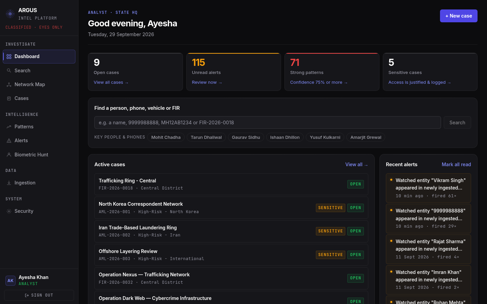
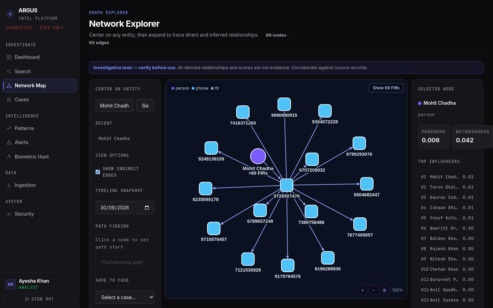
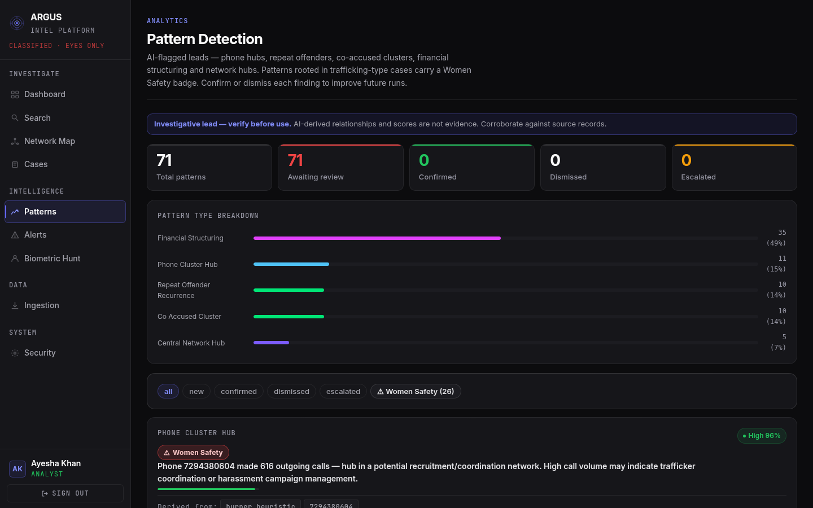
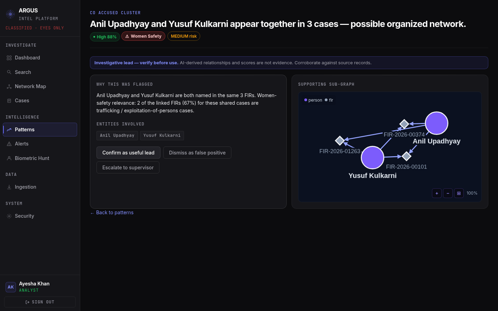
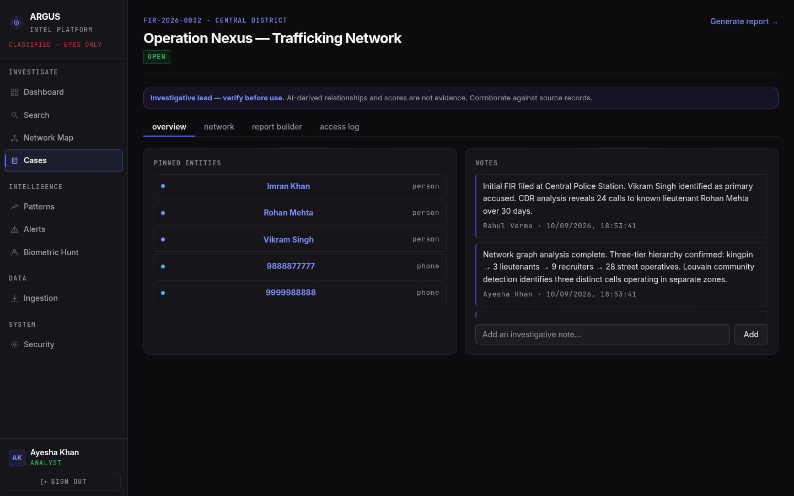
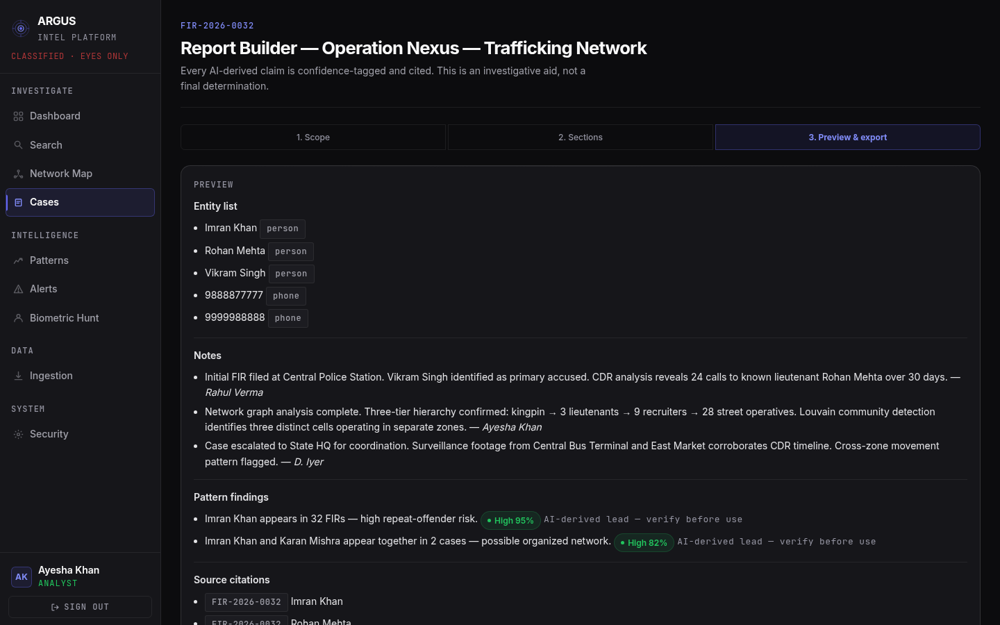
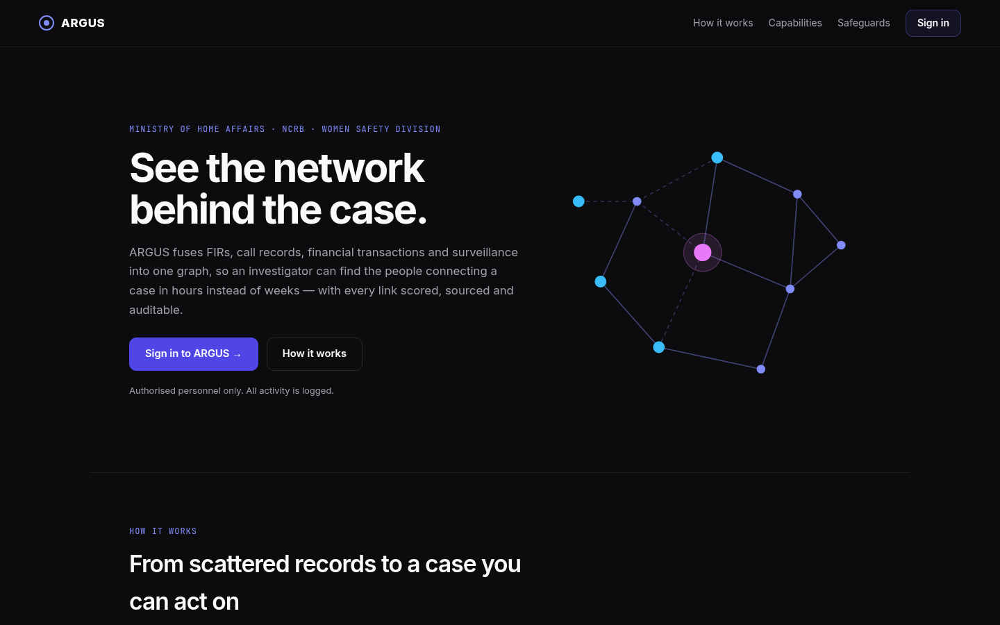
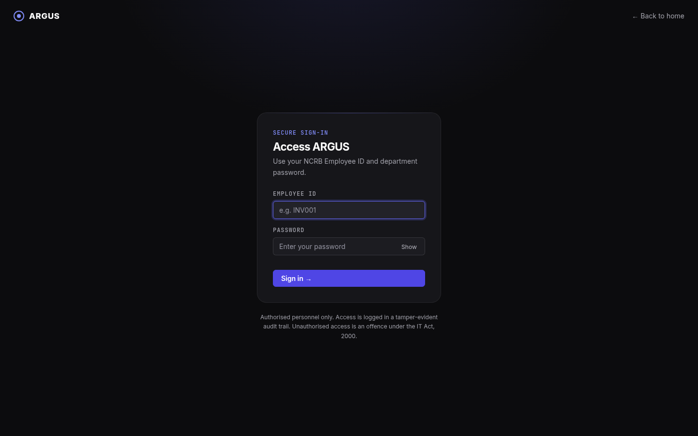

# ARGUS — Criminal Network Analysis

[](https://github.com/ShankarAdhikary/ARGUS/actions/workflows/ci.yml)


ARGUS is a data-fusion and graph-intelligence platform for crime investigation. It ingests FIRs, call-detail
records, bank transactions and surveillance sightings, extracts the people, phones and accounts they mention,
links them into one graph, and surfaces the connections an investigator would otherwise spend days finding by hand:
key players, burner-phone clusters, structuring patterns and repeat offenders under different spellings.
It is built for investigators, intelligence analysts and supervising officers (originally the NCRB Women Safety
Division brief). ARGUS is an **investigative aid, not a decision-maker**: every AI-derived link carries a
confidence score and a source, is labelled "investigative lead — verify before use", and identity merges always
need a human to confirm.

> ⚠️ Everything in this repository runs on **synthetic demo data**. Do not load real case data without first
> completing the security hardening listed under [Before real use](#before-real-use).

## Quick start

You need Docker (with Compose v2), Node.js 18+ and about 6 GB of free RAM.

```bash
git clone https://github.com/ShankarAdhikary/ARGUS.git
cd ARGUS

# 1. Create ARGUS-Pipeline/.env with freshly generated random secrets (never commit that file)
python3 ARGUS-Pipeline/scripts/init_env.py
#    Optional: add GROQ_API_KEY or GEMINI_API_KEY to it for better text extraction
#    (without one, extraction falls back to simple pattern matching).

# 2. Build the web app (nginx serves it) and start the stack (nginx, API, worker, Vault, Postgres/PostGIS, Neo4j,
#    Elasticsearch, MinIO, Redis). The first start initialises Vault and prints VAULT_UNSEAL_KEY - copy it into .env.
(cd ARGUS-Frontend && npm install && npm run build)
python ARGUS-Pipeline/scripts/preflight.py && docker compose up -d --build

# 3. Load the demo dataset (idempotent; see the script headers for details)
docker compose exec api python generate_demo_dataset.py
docker compose exec api python load_demo.py
docker compose exec api python seed_demo_cases.py

# 4. Start the web app
cd ARGUS-Frontend
cp .env.example .env
npm install
npm run dev
```

Open **https://localhost** (self-signed certificate in development: accept the browser warning). nginx terminates TLS,
serves the built web app and proxies `/api`, `/health` and `/docs` to the API, which is not published on the host.
For hot reload use `npm run dev` (http://localhost:5173, API at https://localhost). To reach the Neo4j browser or MinIO
console locally, add `-f docker-compose.debug.yml`; that override is refused when `ARGUS_ENV=production`.

## Demo credentials

These accounts are created on first start when `SEED_DEMO_USERS=true` (the default for local development).

| Role | Employee ID | Password | Sees |
|---|---|---|---|
| Investigator | `INV001` | `demo123` | Only cases in their own jurisdiction (Central District) |
| Analyst | `ANL001` | `demo123` | All cases, patterns, graph; cannot ingest data |
| Supervisor | `SUP001` | `demo123` | All cases and ingestion health |
| Admin | `admin@demo.com` | `password123` | Everything, plus the Admin console and audit log |

The sign-in page does not show these by default. To get one-click demo buttons in development, set
`VITE_SHOW_DEMO_ACCOUNTS=true` in `ARGUS-Frontend/.env`. **Set `SEED_DEMO_USERS=false` and change every password
outside local development.** These passwords are published in this public repository, so treat them as known to
everyone: the API refuses to start in production mode (`ARGUS_ENV` other than `development`) while `SEED_DEMO_USERS=true`
or while any secret is still a placeholder.

## Architecture

| Component | Location | Role |
|---|---|---|
| API | `ARGUS-Pipeline/main.py`, `platform_api.py` | FastAPI: ingestion, search, graph queries, cases, patterns, alerts, reports, audit, MFA |
| Worker | `ARGUS-Pipeline/worker.py` | Consumes the Redis queue and writes records to Elasticsearch and Neo4j |
| Entity extraction | `ARGUS-Pipeline/text_extraction.py` | LLM zero-shot extraction (Groq/Gemini) with a regex fallback |
| Neo4j | container | Knowledge graph of people, phones, FIRs, accounts and cameras; centrality and community analytics |
| Elasticsearch | container | Full-text search over FIRs and the master dossier |
| PostgreSQL | container | Users, cases, notes, alerts, pattern feedback and the hash-chained, append-only audit log |
| Redis | container | Job queue, ingestion status and login lockout counters |
| MinIO | container | Raw uploaded source files |
| Face index | `ARGUS-Pipeline/face_index.py` | Persistent FAISS index of ArcFace embeddings for the biometric hunt |
| Web app | `ARGUS-Frontend/` | React + TypeScript + Vite; Cytoscape network explorer |

Auth is JWT with role-based access (investigator / analyst / supervisor / admin), optional TOTP two-step
verification (`MFA_REQUIRED_ROLES` makes it mandatory per role), and a justification prompt for sensitive cases.
Case access is enforced twice: by the API and by Postgres row-level security (each request runs as a restricted
database role scoped to the caller's jurisdiction). Search and the accused network are scoped by jurisdiction too.
The API contract is in `ARGUS-Pipeline/openapi-mvp-v1.json`, with a change log in
`ARGUS-Pipeline/API_CONTRACT_CHANGELOG.md`.

## Optional features

| Feature | How to turn it on |
|---|---|
| **Word reports** | Always available: choose "Word .docx" in the Report Builder, or `POST /api/v1/reports/export?format=docx`. |
| **Keycloak / OIDC single sign-on** | Set `KEYCLOAK_URL` (and `KEYCLOAK_REALM`, `KEYCLOAK_AUDIENCE`) in `ARGUS-Pipeline/.env`. Only tokens from that realm are then accepted and local sign-in is disabled. Backend only: the web app has no SSO redirect yet. |
| **Hindi named-entity fallback** | Build with `docker compose build --build-arg INSTALL_INDIC_NER=true api` (adds gigabytes), then set `ENABLE_INDIC_NER=true`. Downloads a ~400 MB model on first use. |

## Tests

The unit and integration suites must run in separate processes:

```bash
docker compose exec api pip install pytest httpx python-docx
docker compose exec api python -m pytest tests/unit
docker compose exec -e ARGUS_LIVE_TESTS=1 api python -m pytest \
  tests/integration/test_live_api.py tests/integration/test_phase2_analytics.py tests/integration/test_rls.py
```

The ingestion integration tests write data and are meant for a disposable stack only.

**Load test** (50 users for 60 s; fails if search p95 exceeds 3 s). It writes audit-log rows, which cannot be deleted, so
use a test stack:

```bash
docker run --rm --network host -v "$PWD/ARGUS-Pipeline/tests/load":/load -w /load python:3.12-slim sh -c \
  "pip install -q locust && locust -f locustfile.py --headless -u 50 -r 5 --run-time 60s --host http://localhost:8000"
```

## Before real use

Not yet done: TLS and encryption at rest, a secrets vault, jurisdiction scoping of the phone/financial/path graph
endpoints and analytics, regional-language extraction beyond the optional Hindi model, real data-source connectors
(CCTNS, ICJS and others), high-availability deployment, and independent security audits. `WORK_PLAN_24H.md` tracks status.

## Screenshots

All screenshots use the synthetic demo dataset.

| | |
|---|---|
| <br>**Dashboard** — clickable overview, grouped alerts, live dataset counts | <br>**Network explorer** — people, phones and FIRs; leaf FIRs collapse behind a toggle |
| <br>**Pattern detection** — Women Safety badge only where the FIRs are trafficking-type cases | <br>**Pattern detail** — the evidence in plain language, with a supporting sub-graph |
| <br>**Case workspace** — pinned entities and investigative notes | <br>**Report builder** — PDF or Word export, limited to this case's patterns |
| <br>**Home** | <br>**Sign in** (with optional two-step verification) |

## Contributing and security

Issues and pull requests are welcome. CI runs the backend unit tests, type-checks and builds the frontend, and validates the
Docker Compose stack on every push. To report a vulnerability privately, see [SECURITY.md](SECURITY.md).

## License

No license has been chosen yet, so all rights are reserved: the code is visible, but nobody has permission to reuse it.
Add a `LICENSE` file to change that.
